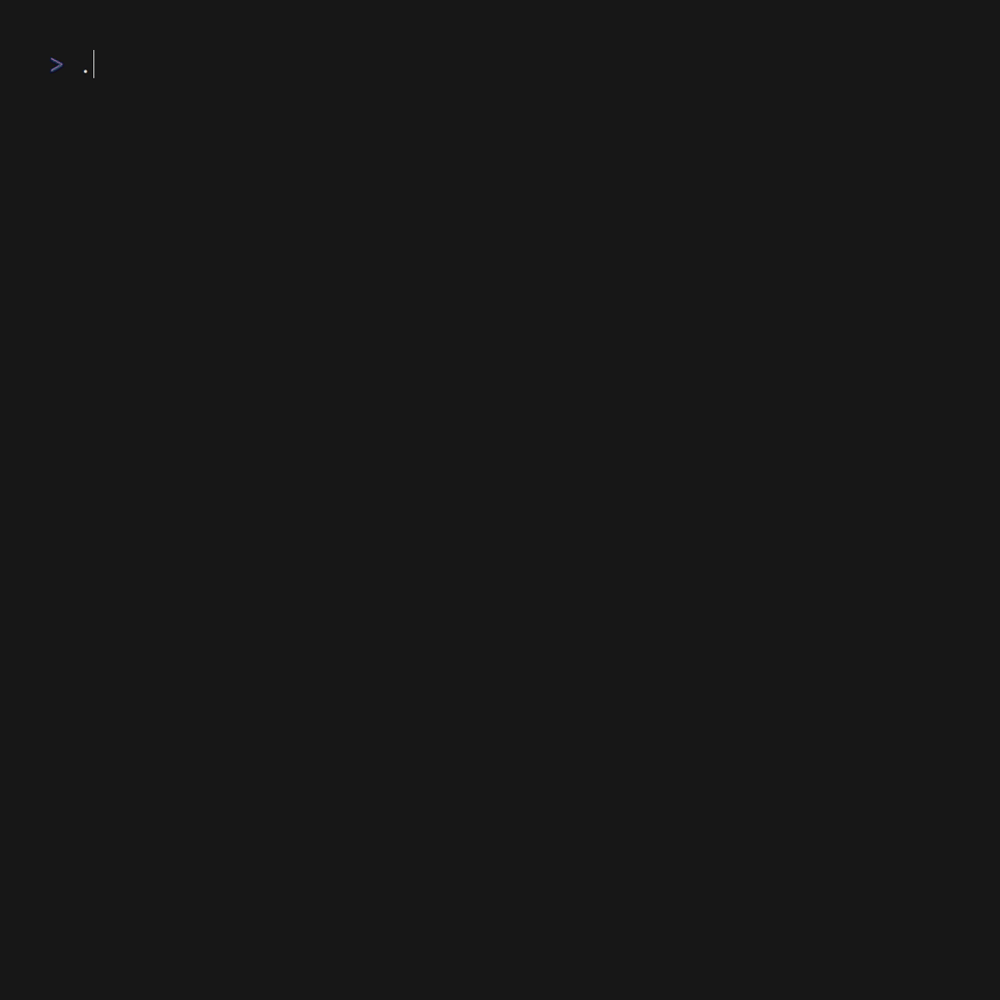

# 📰 gross

terminal RSS reader written in Go

## Features

* Works out of the box with `newsboat` url-file syntax: just paste your file in `$HOME/.config/gross/urls`.
* Supported newsboat commands: alias, `filter:cmd:url`

## Keys
* Vim-keys for navigation
* `a/A` toggles unread status and toggles everything as read, respectively
* `o` opens in browser/plumber script that can be set in `.config/gross/config.toml`

## Roadmap

* Allow custom keybindings
* Make unified "title" command to organize feeds
* Rewrite TUI lists from scratch and add header/footer bar with lipgloss
